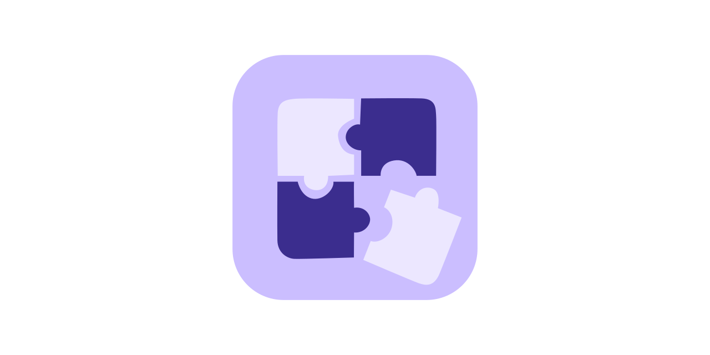

  

<h1 align="center"> Plugins </h1>
# This is very "Ambitious" yet very early stage plugins system and a very new concept for me ^^

## Current State - RoadMap
- [-] Docs
  - [ ] ~Website~ ?
- [ ] Hot Reload
- [X] Singletons
  - [ ] Persistence Convenient Solution
- [x] Color Palettes
- [x] Sidebar Modules (adds new sidebar contents)
- [x] Dock
- [x] Beam
  - [x] Bash Commands
  - [x] Qml Functions
- [ ] Plugins gui easy installer
  - [x] cli backend 
- [ ] Desktop Widgets --- KDE API Workarounds (if possible)
- [ ] Bars
  - [ ] Bar Modules
  - [ ] Bar (v/h)Map Presets for Dynamic bars
- [ ] Dialog Components
- [ ] Routines - Automations
- [x] ~New Ambient Sounds~ 
- [ ] AI Skills - Functions
- [ ] Complete Panels Alterations
- [ ] Persistance workarounds
## Plugins list
### Dock 
DockNatives
- [x] Timers
- [x] Media
- [ ] Weather
Other Components 
- [ ] Bar Modules

### Sidebar
- [x] Games
- [x] Web
- [x] Deen
- [x] Quickshare
- [x] Sokoun (Ambient Sounds)
- [x] Radio
## Noon IPC
- this is the trigger for shell to know exactly when to behave
- currently it has a global plugins reload 
- noon ipc call plugins reload reloads all
- run `noon ipc call plugins show` for avilable actions

## nplugins (The Cli)
- the script that manages plugins adding removal enabling disabling qmldir creation and manifest.json processing 
- usage example npluins enable group plugin's folder name 
  -f to force action

## Directories Integrity and Plugins Creation
All plugins are inside `~/.noon_plugins/`.
- for the path u need to add prefix `@plugins` for the shell imports to work and use normal qs imports
- every panel has different group eg, ../sidebar, ../palettes, etc
- each plugin has to be in a different folder with explicitly named manifest.json
- i dont advice bundling plugins in different subfolders for how inconvenient it can get with qmldir stuff ~Current State Only~
- qml js engine doesn't pick the imports of the non-siblings this means qmldir has to be created in each subdir recruisively while cli install them

### Singletons
- Singletons are defined explicitly in an array in manifest.json (This is Crucial for qmldir creation and initialization)
- Singletons Are treated as first class citizens you basically develop as native qs project

### Color Palettes
those are files inside the "palettes" in format `${PALETTE_NAME}.json` 
- each file name is the same name of palette in UI
- adds are reactive and NO RELOAD NEEDED.
- json keys are material3 colors with m3prefixed camel case check plugins/palettes/example.json

### Sidebar Plugins
- This adds new sidebar content pages 
- you can define all needed behaviors for a typical sidebar module
- check the plugins/sidebar/manifest.json

### Dock Plugins
- each plugin is a component runs inside the dock needs an entry direction according to the dockapps in order to be replicated
- see docks example

### Beam Plugins
- check beam manifest example

## Hinter & Executor
Both are **arrow function strings** evaluated at load time. They run with access to:
 
| Name | Description |
|---|---|
| `cleanQuery` | Current input without prefix |
| `activeHint` | Current hint value (readable + writable) |
| `activeState` | Current active state key |
| `exec(cmd)` | Fire and forget shell command |
| `shell(cmd, cb?)` | Run shell command, result lands in `activeHint` |
 
---
## Query Placeholders
 
| Placeholder | Resolved at | Use in |
|---|---|---|
| `%q` | Build time → `ctx.cleanQuery` | JS code position |
| `$q` | Call time inside `exec`/`shell` | Shell command strings |
 
- `shell` is debounced by query — if `cleanQuery` hasn't changed the command won't re-run
- For `executor` prefer `exec` over `shell` unless you need the output
- Plugins are merged into the registry after built-in states — they can override by using the same key
